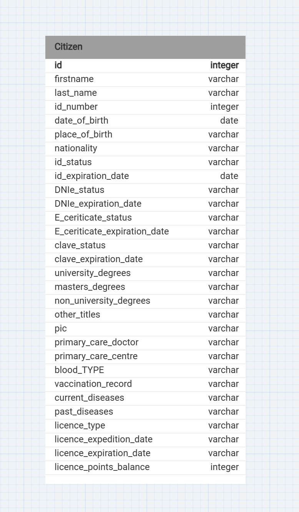
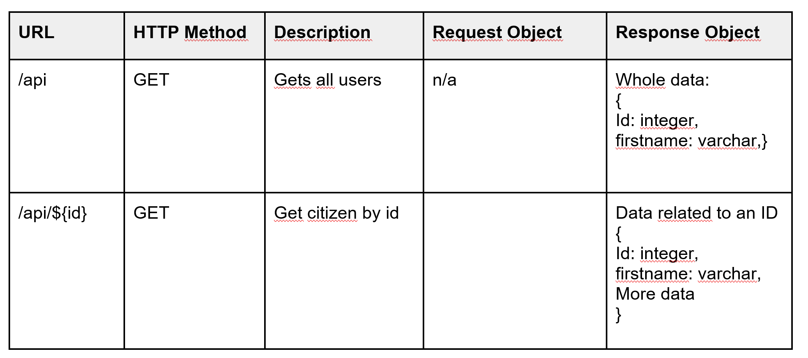
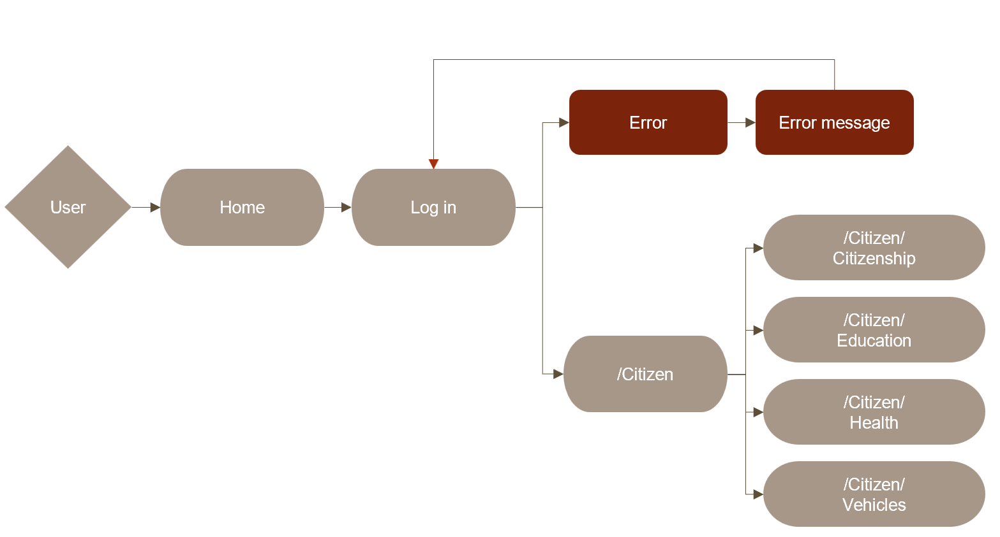
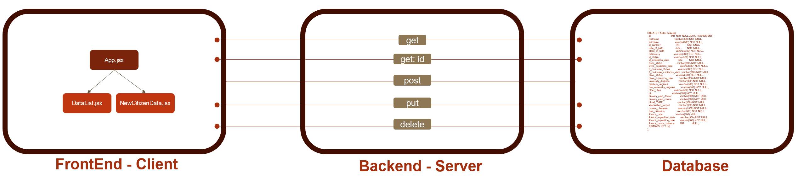

### Technical design






### Dependencies

- Run `npm install` in project directory. This will install server-related dependencies such as `express`.
- `cd client` and run `npm install`. This will install client dependencies (React).

### Database Prep

- Access the MySQL interface in your terminal by running `mysql -u root -p`
- Create a new database called citizens: `create database citizens`
- Add a `.env` file to the project folder of this repository containing the MySQL authentication information for MySQL user. For example:

```bash
  DB_HOST=localhost
  DB_USER=root
  DB_NAME=citizens
  DB_PASS=YOURPASSWORD
```

- Run `npm run migrate` in the project folder of this repository, in a new terminal window. This will create a table called 'citizens' in your database.

- Make sure you understand how the `citizens` table is constructed. In your MySQL console, you can run `use citizens;` and then `describe citizens;` to see the structure of the citizens table.
*Note that, in this case the name "citizens" has been used for both the name of the database and the table inside it.

### Development

- Run `npm start` in project directory to start the Express server on port 5000
- In another terminal, do `cd client` and run `npm run dev` to start the client in development mode with hot reloading in port 5176.


_This is a student project that was created at [CodeOp](http://codeop.tech), a full stack development bootcamp in Barcelona._